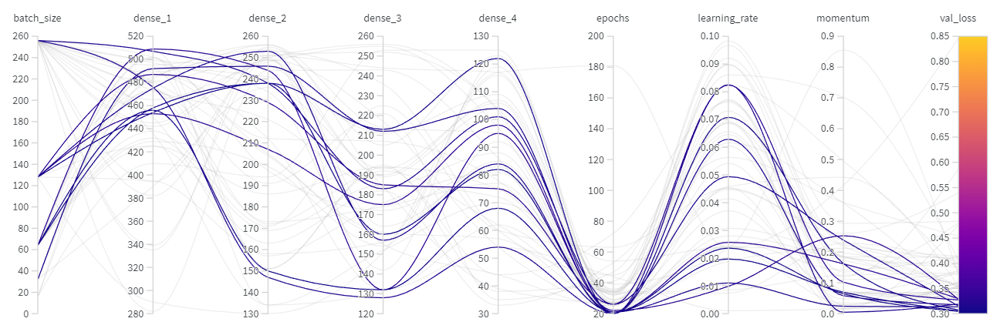
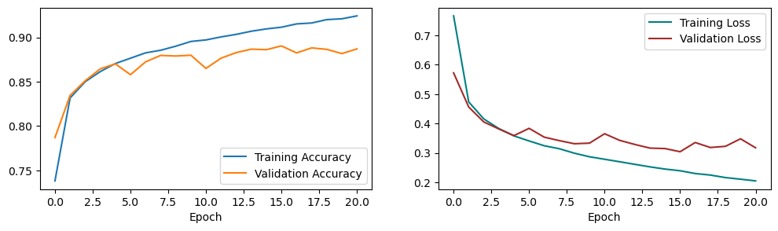
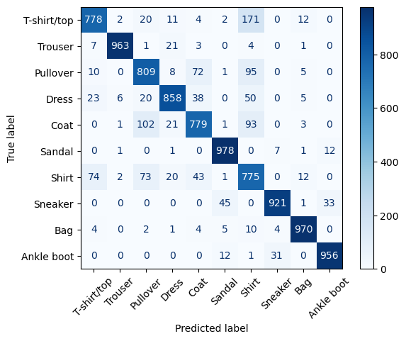
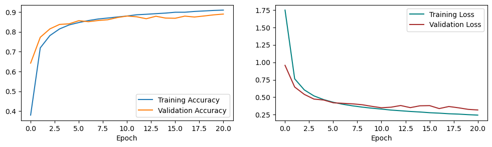

# Project 1 - MLP in Tensorflow and PyTorch

Course: Neural Networks @ FIIT STU\
Authors: Viktor Modroczký & Michaela Hanková

## Training and Testing Environment

We used Jupyter Notebooks on Kaggle for training and testing. Kaggle provides free GPU resources for sufficient time. Our Kaggle notebooks were configured to use the NVDIA Tesla P100 graphics card. At the time of writing, the Python version on Kaggle was 3.7.12.

If you want to run the notebooks on your own machine, you need to build a Docker image. The Dockerfile is provided in the root directory of this repository. The image is based on the [python:3.7.12-slim](https://hub.docker.com/layers/library/python/3.7.12-slim/images/sha256-f16187eda47e7b66ab1238ff562223da599c78d7b494d7fbed329b56c5f41144) Docker image. Our image contains all the necessary Python packages for running the notebooks.

The following commands have to be run from the root directory of this repository.

To build the image, run the following command:

```bash
docker build -t nn-project-1 .
```

To run the image, run the following command:

Linux:

```bash
docker run --rm -it -p 8888:8888 -v $(pwd)/src:/mlp/src nn-project-1
```

Windows CMD:

```bash
docker run --rm -it -p 8888:8888 -v %cd%/src:/mlp/src nn-project-1
```

Windows PowerShell:

```bash
docker run --rm -it -p 8888:8888 -v ${PWD}/src:/mlp/src nn-project-1
```

The image will start a Jupyter Notebook server. You can access it from the link provided in the output of the command.

## Dataset

We used the [Fashion-MNIST](https://github.com/zalandoresearch/fashion-mnist) dataset for this project. It contains 60,000 training images and 10,000 test images. Each image is a 28x28 grayscale image, associated with a label from 10 classes. The dataset is available in both libraries.

## Model Architecture

The model is a Multi-Layer Perceptron. It has 784 inputs which represent the pixels of the image. Inputs are normalized to the range [0, 1]. There are 4 hidden layers and an output layer with 10 neurons, one for each class. Each hidden layer uses the ReLU activation function. We used Stochastic Gradient Descent with momentum as the optimizer. The validation split is 20%. The model is implemented in both Tensorflow and PyTorch.

## Hyperparameter Tuning

To tune the hyperparameters we used the Bayesian Optimization algorithm in the Weights & Biases library. During tuning, the network was trained 50 times. The goal was to minimize the validation loss. The metrics we monitored were the training loss, validation loss, training accuracy, and validation accuracy. The hyperparameters we tuned are the learning rate, momentum, batch size, number of epochs, and the number of units in each hidden layer. We defined the following search space for the hyperparameters.

| Hyperparameter | Range |
|----------------|-------|
| Learning rate | min: 0.0001, max: 0.1 |
| Momentum | min: 0.0, max: 0.9 |
| Batch size | [16, 32, 64, 128, 256] |
| Number of epochs | min: 20, max: 200 |
| Units in first hidden layer | min: 256, max: 512 |
| Units in second hidden layer | min: 128, max: 256 |
| Units in third hidden layer | min: 128, max: 256 |
| Units in fourth hidden layer | min: 32, max: 128 |

The following table shows the best values for the hyperparameters.

| Hyperparameter | Value |
|----------------|-------|
| Learning rate | 0.023615358865991583 |
| Momentum | 0.06432719692244611 |
| Batch size | 64 |
| Number of epochs | 21 |
| Units in first hidden layer | 456 |
| Units in second hidden layer | 150 |
| Units in third hidden layer | 132 |
| Units in fourth hidden layer | 68 |

The following graph shows the 10 best permutations of hyperparameters from the search space. You can click on the graph to see the Sweep report on the Weights & Biases website.

[](https://api.wandb.ai/links/nsiete23/zokyptyt)

## Implementation

Both implementations are available in the `src` directory. The implementations are in Jupyter Notebooks. The notebook named `tf-mlp-tuning.ipynb` contains hyperparameter tuning performed on the Tensorflow implementation. The notebook named `tf-mlp-tuned.ipynb` contains the final model implemented in Tensorflow. The notebook named `torch-mlp-tuned.ipynb` contains the final model implemented in PyTorch. Both are trained with the best hyperparameters found during tuning. Both models use the Sequential API in their respective libraries.

### Tensorflow Implementation

The loss function used is Sparse Categorical Crossentropy. The activation function used in the output layer is the Softmax function. The training accuracy reached 0.9243 and the validation accuracy reached 0.8870. The training loss reached 0.2050 and the validation loss reached 0.3174. The model has an accuracy of 0.8787 on the test dataset. More metrics are available in the `tf-mlp-tuned.ipynb` notebook.

The following graph shows the training and validation loss and accuracy during training.



The following graph shows the confusion matrix for the test dataset.



### PyTorch Implementation

The loss function used is Negative Log Likelihood. The activation function used in the output layer is the LogSoftmax function. The training accuracy reached 0.9091 and the validation accuracy reached 0.8892. The training loss reached 0.2435 and the validation loss reached 0.3172. The model has an accuracy of 0.8821 on the test dataset. More metrics are available in the `torch-mlp-tuned.ipynb` notebook.

The following graph shows the training and validation loss and accuracy during training.



The following graph shows the confusion matrix for the test dataset.


## Comparison and Conclusion

Both frameworks offer a similar Sequential API which provides a container for layers. The Sequential constructor in Tensorflow takes a list of layers as a parameter, whereas PyTorch takes layers as parameters or an OrderedDict of layers as a single parameter. Fully connected layers in Tensorflow are implemented as Dense layers, whereas PyTorch uses Linear layers. Dense layers in Tensorflow only require the number of units in the layer as a parameter, whereas Linear layers require the number of inputs and the number of units in the layer as parameters.

Tensorflow, in addition to custom training loops, includes a fit method for model training and validation, but PyTorch relies on the programmer to create their own training loop, where we need to zero gradients, run the forward pass, calculate the loss, run the backward pass, and update the weights in each batch of an epoch, and validation loop after each parameter optimization step. In addition to training, the fit method is able to create a validation dataset from the training dataset. In PyTorch, we had to create a validation dataset manually.

Both frameworks have different approaches to loss functions. In PyTorch, we used Negative Log Likelihood, which expects the output of the model to be a log of the probability distribution (output of LogSoftmax). In Tensorflow, we used Sparse Categorical Crossentropy, which expects the output of the model to be a distribution of probabilities (output of Softmax). We note that the alternative in PyTorch is to use Cross Entropy Loss without applying LogSoftmax to the output of the model because this loss function applies LogSoftmax and NLLLoss in a single class.

Both models trained on the best hyperparameters were evaluated on the test dataset containing 10,000 images. The results show similar test accuracies, 0.8787 and 0.8821 for Tensorflow and PyTorch respectively. Based on the confusion matrix both models struggled the most with classifying the T-shirt/top, Pullover, Coat, and Shirt classes because they likely share similar features.

By assessing the training and validation loss and accuracy graphs, we can see that the Tensorflow model had a greater gap between the training and validation loss and accuracy. This indicates higher variance in the Tensorflow model.

Overall, we found that Tensorflow has a more beginner-friendly way of training models by offering a fit method, which can be used in non-complex use cases.
