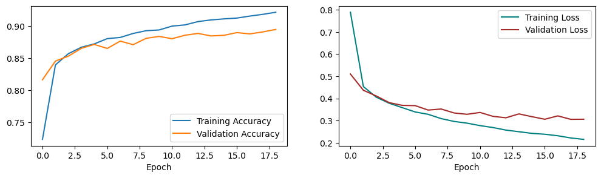

# Project 1 - MLP in Tensorflow and PyTorch

Course: Neural Networks @ FIIT STU\
Authors: Viktor Modroczký & Michaela Hanková

## Training and Testing Environment

We used Jupyter Notebooks on Kaggle for training and testing. Kaggle provides free GPU resources for sufficient time. Our Kaggle notebooks were configured to use the NVDIA Tesla P100 graphics card. At the time of writing, the Python version on Kaggle was 3.7.12.

If you want to run the notebooks on your own machine, you need to build a Docker image. The Dockerfile is provided in the root directory of this repository. The image is based on the [python:3.7.12-slim](https://hub.docker.com/layers/library/python/3.7.12-slim/images/sha256-f16187eda47e7b66ab1238ff562223da599c78d7b494d7fbed329b56c5f41144) Docker image. Our image contains all the necessary Python packages for running the notebooks.

The following commands have to be run from the root directory of this repository.

To build the image, run the following command:

```bash
docker build -t nn-project-1 .
```

To run the image, run the following command:

Linux:

```bash
docker run --rm -it -p 8888:8888 -v $(pwd)/src:/mlp/src nn-project-1
```

Windows CMD:

```bash
docker run --rm -it -p 8888:8888 -v %cd%/src:/mlp/src nn-project-1
```

Windows PowerShell:

```bash
docker run --rm -it -p 8888:8888 -v ${PWD}/src:/mlp/src nn-project-1
```

The image will start a Jupyter Notebook server. You can access it from the link provided in the output of the command.

## Utility Scripts

To avoid writing duplicate code in notebooks, we have created several scripts that contain functions needed to train, test, and evaluate a neural network. The scripts are located in the [`src`](./src/) directory.

### [plot_utils.py](./src/plot_utils.py)

This script contains the following functions:

- `plot_training` - plots training and validation accuracy and loss
- `show_confusion_matrix` - shows the confusion matrix

### [tf_utils.py](./src/tf_utils.py)

This script contains the following functions for the Tensorflow implementation:

- `create_model` - creates the MLP
- `train_model` - trains the MLP

### [torch_utils.py](./src/torch_utils.py)

This script contains the following functions for the PyTorch implementation:

- `split_data` - splits the dataset into training, validation, and test sets
- `create_model` - creates the MLP
- `evaluate` - evaluates the MLP
- `fit` - trains the MLP

## Dataset

For this project, we used the [Fashion-MNIST](https://github.com/zalandoresearch/fashion-mnist) dataset introduced by Han Xiao, Kashif Rasul, and Roland Vollgraf in 2017 in their paper [Fashion-MNIST: a Novel Image Dataset for Benchmarking Machine Learning Algorithms](https://arxiv.org/abs/1708.07747).

This dataset contains 60,000 training images and 10,000 test images. Each image is a 28x28 grayscale image, associated with a label from 10 classes. The dataset is available to import in both libraries.

The following table shows the labels and their corresponding classes.

| Label | Class |
|-------|-------|
| 0 | T-shirt/top |
| 1 | Trouser |
| 2 | Pullover |
| 3 | Dress |
| 4 | Coat |
| 5 | Sandal |
| 6 | Shirt |
| 7 | Sneaker |
| 8 | Bag |
| 9 | Ankle boot |

The following images show examples of the images in the dataset.


## Model Architecture

The model is a Multi-Layer Perceptron. It has 784 inputs which represent the pixels of an image. Inputs are normalized to the range [0, 1]. There are 4 hidden layers and an output layer with 10 neurons, one for each class. Each hidden layer uses the ReLU activation function. The validation split is 20%. The model is implemented in both Tensorflow and PyTorch.

## Hyperparameter Tuning

Hyperparameter tuning was performed on the Tensorflow implementation. To tune the hyperparameters we used the Bayesian Optimization algorithm in the Weights & Biases library. We tried 3 different optimizers during tuning: Adam, SGD, and RMSprop. The code for the tuning is available in [`tf-mlp-sgd-tuning.ipynb`](./src/tf-mlp-sgd-tuning.ipynb), [`tf-mlp-adam-tuning.ipynb`](./src/tf-mlp-adam-tuning.ipynb), and [`tf-mlp-rmsprop-tuning.ipynb`](./src/tf-mlp-rmsprop-tuning.ipynb) in the [`src`](./src/) directory for SGD, Adam, and RMSprop, respectively.

During tuning, the network was trained 150 times in total - 50 times with different permutations of hyperparameters for each optimizer. The metrics we monitored during tuning were the training loss, validation loss, training accuracy, and validation accuracy. The goal of the tuning was to minimize the validation loss.

We defined the following search space for the hyperparameters for all optimizers.

| Hyperparameter | Range |
|----------------|-------|
| Batch size | [16, 32, 64, 128, 256] |
| Number of epochs | min: 15, max: 50 |
| Units in first hidden layer | min: 256, max: 512 |
| Units in second hidden layer | min: 128, max: 256 |
| Units in third hidden layer | min: 128, max: 256 |
| Units in fourth hidden layer | min: 32, max: 128 |

The search space for the SGD optimizer includes the following hyperparameters in addition to the ones listed above.

| Hyperparameter | Range |
|----------------|-------|
| Learning rate | min: 0.0001, max: 0.1 |
| Momentum | min: 0.0, max: 0.9 |

The search space for the Adam optimizer includes the following hyperparameters in addition to the ones listed in the first table.

| Hyperparameter | Range |
|----------------|-------|
| Learning rate | min: 0.0001, max: 0.1 |
| Beta 1 | min: 0.9, max: 0.999 |
| Beta 2 | min: 0.99, max: 0.9999 |

The search space for the RMSprop optimizer includes the following hyperparameters in addition to the ones listed in the first table.

| Hyperparameter | Range |
|----------------|-------|
| Learning rate | min: 0.0001, max: 0.1 |
| Momentum | min: 0.0, max: 0.9 |
| Rho | min: 0.8, max: 0.999 |

The following table shows the best values for the hyperparameters.

| Hyperparameter | Value for SGD | Value for Adam | Value for RMSprop |
|----------------|---------------|----------------|-------------------|
| Batch size | 128 | 128 | 256 |
| Number of epochs | 20 | 19 | 15 |
| Units in first hidden layer | 414 | 485 | 363 |
| Units in second hidden layer | 205 | 176 | 246 |
| Units in third hidden layer | 141 | 131 | 147 |
| Units in fourth hidden layer | 106 | 122 | 99 |
| Learning rate | 0.08418417163921542 | 0.00012885226472854095 | 0.001266287404751428 |
| Momentum | 0.31453202807460157 | N/A | 0.27566146279392545 |
| Beta 1 | N/A | 0.986435025614692 | N/A |
| Beta 2 | N/A | 0.9904482393527106 | N/A |
| Rho | N/A | N/A | 0.9841212943927308 |

We found that the Adam optimizer converged more smoothly than the other two optimizers. All three optimizers converged to a similar validation loss and accuracy. We chose the Adam optimizer for the final model.

You can find the Sweep report [here](https://api.wandb.ai/links/nsiete23/xwe6x00n).

## Implementation

Both implementations are available in the [`src`](./src/) directory. The implementations are in Jupyter Notebooks. The notebook named [`tf-mlp-tuned.ipynb`](./src/tf-mlp-tuned.ipynb) contains the final model implemented in Tensorflow. The notebook named [`torch-mlp-tuned.ipynb`](./src/torch-mlp-tuned.ipynb) contains the final model implemented in PyTorch. Both are trained with the best hyperparameters found during tuning, which we load to a variable named `config` with the help of the Wandb API. Both models use the Sequential API and Adam optimizer in their respective libraries.

The following table shows the hyperparameters used in the final model with the Adam optimizer.

| Hyperparameter | Value |
|----------------|-------|
| Batch size | 128 |
| Number of epochs | 19 |
| Units in first hidden layer | 485 |
| Units in second hidden layer | 176 |
| Units in third hidden layer | 131 |
| Units in fourth hidden layer | 122 |
| Learning rate | 0.00012885226472854095 |
| Beta 1 | 0.986435025614692 |
| Beta 2 | 0.9904482393527106 |

### Tensorflow Implementation

The loss function used is Sparse Categorical Crossentropy. The activation function used in the output layer is the Softmax function.

The Tensorflow model is implemented as follows.

```py
Sequential([
  Rescaling(scale=1./255, input_shape=(28, 28)),
  Flatten(),
        
  Dense(config.dense_1, activation='relu'),
  Dense(config.dense_2, activation='relu'),
  Dense(config.dense_3, activation='relu'),
  Dense(config.dense_4, activation='relu'),

  Dense(10, activation='softmax'),
])
```

The `Rescaling` layer is used to normalize the inputs to the range [0, 1] and the `Flatten` layer is used to flatten the 28x28 images to 784 inputs.

The following graph shows the training and validation loss and accuracy during training.



The following graph shows the confusion matrix for the test dataset.


The following table shows metrics for the Tensorflow implementation.

| Metric | Value |
|--------|-------|
| Training accuracy | 0.9259 |
| Validation accuracy | 0.8882 |
| Training loss | 0.2042 |
| Validation loss | 0.3175 |
| Test accuracy | 0.8840 |

More metrics are available in the [`tf-mlp-tuned.ipynb`](./src/tf-mlp-tuned.ipynb) notebook.

### PyTorch Implementation

The loss function used is Negative Log Likelihood. The activation function used in the output layer is the LogSoftmax function.

The PyTorch model is implemented as follows.

```py
Sequential(
    Flatten(),
    Linear(28 * 28, config.dense_1),
    ReLU(),
    Linear(config.dense_1, config.dense_2),
    ReLU(),
    Linear(config.dense_2, config.dense_3),
    ReLU(),
    Linear(config.dense_3, config.dense_4),
    ReLU(),
    Linear(config.dense_4, 10),
    LogSoftmax(dim=1)
)
```

We also use a `Flatten` layer like in the Tensorflow implementation. We used the `ToTensor` transform on the input datasets, which converts the images to tensors and normalizes the pixel values to the range [0, 1] like the `Rescaling` layer in Tensorflow.

```py
data = FashionMNIST(root='../data', download=True, transform=ToTensor())
test = FashionMNIST(root='../data', download=True, train=False, transform=ToTensor())
```

The following graph shows the training and validation loss and accuracy during training.


The following graph shows the confusion matrix for the test dataset.


The following table shows metrics for the PyTorch implementation.

| Metric | Value |
|--------|-------|
| Training accuracy | 0.8913 |
| Validation accuracy | 0.8858 |
| Training loss | 0.2997 |
| Validation loss | 0.3197 |
| Test accuracy | 0.8759 |

More metrics are available in the [`torch-mlp-tuned.ipynb`](./src/torch-mlp-tuned.ipynb) notebook.

## Comparison and Conclusion

Both frameworks offer a similar Sequential API which provides a container for layers. The Sequential constructor in Tensorflow takes a list of layers as a parameter, whereas PyTorch takes layers as parameters or an OrderedDict of layers as a single parameter. Fully connected layers in Tensorflow are implemented as Dense layers, whereas PyTorch uses Linear layers. Dense layers in Tensorflow only require the number of units in the layer as a parameter, whereas Linear layers in PyTorch require the number of inputs and the number of units in the layer as parameters.

Tensorflow, in addition to custom training loops, includes a fit method for model training and validation, but PyTorch relies on the programmer to create their own training loop, where it's required to zero gradients, run the forward pass, calculate the loss, run the backward pass, and update the weights in each batch of an epoch, and validation loop after each parameter optimization step. In addition to training, the fit method in Tensorflow is able to create a validation dataset from the training dataset. In PyTorch, we had to create a validation dataset manually.

Both frameworks have different approaches to loss functions. In PyTorch, we used Negative Log Likelihood, which expects the output of the model to be a log of the probability distribution (output of LogSoftmax). In Tensorflow, we used Sparse Categorical Crossentropy, which expects the output of the model to be a distribution of probabilities (output of Softmax). Both, Sparse Categorical Crossentropy in Tensorflow and Negative Log Likelihood in PyTorch, accept target labels as integers. We note that the alternative in PyTorch is to use Cross Entropy Loss without applying LogSoftmax to the output of the model because this loss function applies LogSoftmax and NLLLoss in a single class.

Both models trained on the best hyperparameters were evaluated on the test dataset containing 10,000 images. The results show similar test accuracies, 0.8840 and 0.8759 for Tensorflow and PyTorch respectively. Based on the confusion matrix both models struggled the most with classifying the T-shirt/top, Pullover, Coat, and Shirt classes because they likely share similar features.

By assessing the training and validation loss and accuracy graphs, we can see that the Tensorflow model had a greater gap between the training and validation loss and accuracy. This indicates higher variance in the Tensorflow model.

Overall, we found that Tensorflow has a more beginner-friendly way of training models by offering a fit method, which can be used in non-complex use cases.

## References

- [Tensorflow Docs](https://tensorflow.org/api_docs/python)
- [PyTorch Docs](https://pytorch.org/docs/stable/index.html)
