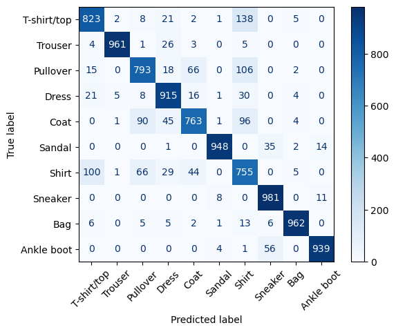
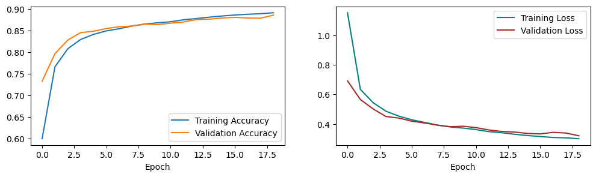

# Project 1 - MLP in Tensorflow and PyTorch

Course: Neural Networks @ FIIT STU\
Authors: Viktor Modroczký & Michaela Hanková

## Training and Testing Environment

We used Jupyter Notebooks on Kaggle for training and testing. Kaggle provides free GPU resources for sufficient time. Our Kaggle notebooks were configured to use the NVDIA Tesla P100 graphics card. At the time of writing, the Python version on Kaggle was 3.7.12.

If you want to run the notebooks on your own machine, you need to build a Docker image. The Dockerfile is provided in the root directory of this repository. The image is based on the [python:3.7.12-slim](https://hub.docker.com/layers/library/python/3.7.12-slim/images/sha256-f16187eda47e7b66ab1238ff562223da599c78d7b494d7fbed329b56c5f41144) Docker image. Our image contains all the necessary Python packages for running the notebooks.

The following commands have to be run from the root directory of this repository.

To build the image, run the following command:

```bash
docker build -t nn-project-1 .
```

To run the image, run the following command:

Linux:

```bash
docker run --rm -it -p 8888:8888 -v $(pwd)/src:/mlp/src nn-project-1
```

Windows CMD:

```bash
docker run --rm -it -p 8888:8888 -v %cd%/src:/mlp/src nn-project-1
```

Windows PowerShell:

```bash
docker run --rm -it -p 8888:8888 -v ${PWD}/src:/mlp/src nn-project-1
```

The image will start a Jupyter Notebook server. You can access it from the link provided in the output of the command.

## Dataset

We used the [Fashion-MNIST](https://github.com/zalandoresearch/fashion-mnist) dataset for this project. It contains 60,000 training images and 10,000 test images. Each image is a 28x28 grayscale image, associated with a label from 10 classes. The dataset is available in both libraries.

## Model Architecture

The model is a Multi-Layer Perceptron. It has 784 inputs which represent the pixels of the image. Inputs are normalized to the range [0, 1]. There are 4 hidden layers and an output layer with 10 neurons, one for each class. Each hidden layer uses the ReLU activation function. We used Stochastic Gradient Descent with momentum as the optimizer. The validation split is 20%. The model is implemented in both Tensorflow and PyTorch.

## Hyperparameter Tuning

To tune the hyperparameters we used the Bayesian Optimization algorithm in the Weights & Biases library. During tuning, the network was trained 50 times. The goal was to minimize the validation loss. The metrics we monitored were the training loss, validation loss, training accuracy, and validation accuracy. The hyperparameters we tuned are the learning rate, momentum, batch size, number of epochs, and the number of units in each hidden layer. We defined the following search space for the hyperparameters.

| Hyperparameter | Range |
|----------------|-------|
| Learning rate | min: 0.0001, max: 0.1 |
| Momentum | min: 0.0, max: 0.9 |
| Batch size | [16, 32, 64, 128, 256] |
| Number of epochs | min: 20, max: 200 |
| Units in first hidden layer | min: 256, max: 512 |
| Units in second hidden layer | min: 128, max: 256 |
| Units in third hidden layer | min: 128, max: 256 |
| Units in fourth hidden layer | min: 32, max: 128 |

The following table shows the best values for the hyperparameters.

| Hyperparameter | Value |
|----------------|-------|
| Learning rate | 0.023615358865991583 |
| Momentum | 0.06432719692244611 |
| Batch size | 64 |
| Number of epochs | 21 |
| Units in first hidden layer | 456 |
| Units in second hidden layer | 150 |
| Units in third hidden layer | 132 |
| Units in fourth hidden layer | 68 |

The following graph shows the 10 best permutations of hyperparameters from the search space. You can click on the graph to see the Sweep report on the Weights & Biases website.

[](https://api.wandb.ai/links/nsiete23/zokyptyt)

## Implementation

Both implementations are available in the `src` directory. The implementations are in Jupyter Notebooks. The notebook named `tf-mlp-tuning.ipynb` contains hyperparameter tuning performed on the Tensorflow implementation. The notebook named `tf-mlp-tuned.ipynb` contains the final model implemented in Tensorflow. The notebook named `torch-mlp-tuned.ipynb` contains the final model implemented in PyTorch. Both are trained with the best hyperparameters found during tuning. Both models use the Sequential API in their respective libraries.

### Tensorflow Implementation

The loss function used is Sparse Categorical Crossentropy. The activation function used in the output layer is the Softmax function. The training accuracy reached 0.9243 and the validation accuracy reached 0.8870. The training loss reached 0.2050 and the validation loss reached 0.3174. The model has an accuracy of 0.8787 on the test dataset. More metrics are available in the `tf-mlp-tuned.ipynb` notebook.

The following graph shows the training and validation loss and accuracy during training.


The following graph shows the confusion matrix for the test dataset.



### PyTorch Implementation

The loss function used is Negative Log Likelihood. The activation function used in the output layer is the LogSoftmax function. The training accuracy reached 0.9091 and the validation accuracy reached 0.8892. The training loss reached 0.2435 and the validation loss reached 0.3172. The model has an accuracy of 0.8821 on the test dataset. More metrics are available in the `torch-mlp-tuned.ipynb` notebook.

The following graph shows the training and validation loss and accuracy during training.



The following graph shows the confusion matrix for the test dataset.


## Comparison

#### Pytorch

The PyTorch framework runs on Python and is based on the Torch library (Lua-based deep learning framework). 

##### Advantages:
1. Pythonic in Nature: Most of the code deployed in PyTorch is pythonic, which means the procedural coding is similar to most of the elements of Python.
PyTorch smoothly integrates with the python data science stack.

2. Easier to Learn: PyTorch is relatively easier to learn than other deep learning frameworks,
as its syntax is similar to conventional programming languages like Python.  

3. Dynamic Computation Graph: PyTorch supports Dynamic Graphs. This feature is especially
useful for changing the network behavior programmatically at runtime.

##### Disadvantages:

1. Visualization Techniques: PyTorch does not have as great an option for visualization, and developers can connect externally
to TensorBoard or use one of the existing Python data visualization tools.  

2. Not as extensive as TensorFlow: The development of actual applications might involve converting the PyTorch code or model into another framework,
as PyTorch is not an end-to-end machine learning development tool. 


#### Tensorflow
It has a comprehensive, flexible ecosystem of tools, libraries and community resources that lets researchers push the state-of-the-art in ML and developers easily build and deploy ML-powered applications.
It supports languages like Python, C++ and R. 

##### Advantages:
1. Data Visualization: TensorFlow provides a tool called TensorBoard that helps with the graphical visualization of data. By reducing the effort of looking at the whole code, the tool facilitates easy node
debugging and effectively helps with an easy resolution of the neural network.

2. Scalability: The scalability offered by TensorFlow is high as it was built to be production-ready and can easily handle large datasets. 

3. Architectural Support: The TensorFlow architecture uses an application-specific AI accelerator called TPU(Tensor Processing Unit),
which offers faster computation than that of GPUs and CPUs.

##### Disadvantages:

1. Training Loops: In TensorFlow, the procedure to create training loops is slightly complex and not very intuitive.  

2. Frequent Updates: As TensorFlow gets updates very often, it becomes overhead for a user to maintain the project as it involves uninstallation and
reinstallation from time to time so that it can bind and be blended with its latest updates.  

The performance of Python is faster for PyTorch. Despite that, due to TensorFlow’s greater support for symbolic manipulation that
allows users to perform higher-level operations, programming models can be less flexible in PyTorch as compared to TensorFlow. 
In general, for most cases, because of its ability to take advantage of any GPU(s) connected to your system, TensorFlow should ideally
provide better performance than PyTorch. Training deep learning models using Autograd that require significantly less memory is one of
the exceptions where PyTorch performs better than TensorFlow in terms of training times.   


